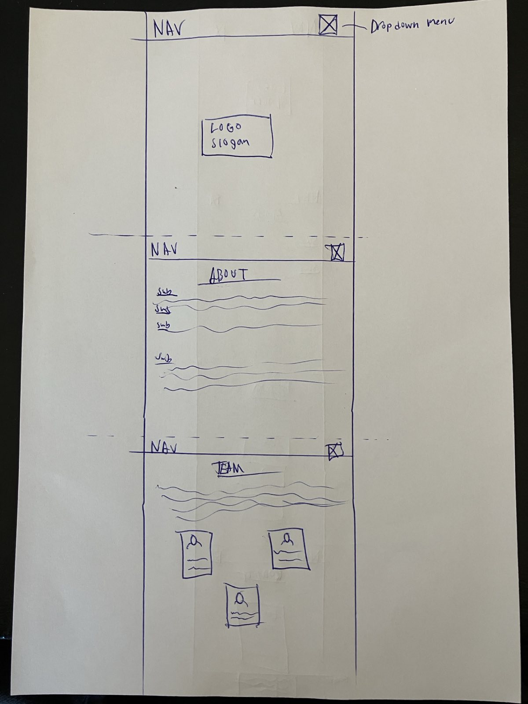

# [shbj-allservice](https://fattig-riddare-90.github.io/shbj-allservice)

source: [shbj-allservice amiresponsive](https://ui.dev/amiresponsive?url=https://fattig-riddare-90.github.io/shbj-allservice)

The goal of this project is to create a professional and user-friendly website for SHBJ Allservice, a company that provides skilled personnel for short- and long-term assignments. Since the company does not own trucks but instead offers workforce solutions, the website will clearly communicate the skills and services available.

Through this professional visual representation of the company the owners hope provide a positive first impression in order to attract more customers and collaborators.

> [!IMPORTANT]
> The examples in these templates are strongly influenced by the Code Institute walkthrough project called "Love Running".

## UX

### The 5 Planes of UX

#### 1. Strategy Plane
##### Purpose

- Provide a professional and informative online presence for SHBJ Allservice.
- Ensure that potential clients quickly understand the company's services and how to contact us.
- Offer a seamless user experience that reflects the company’s reliability and expertise.

##### Primary User Needs
- Learn about SHBJ Allservice’s background, experience, and values.
- Understand the services offered and their benefits.
- Easily find contact information and submit inquiries through a secure contact form.

##### Business Goals
- Attract new business partnerships and clients.
- Improve accessibility and client engagement through an intuitive website.
- Streamline the inquiry and booking process to reduce manual administration.

#### 2. Scope Plane
##### Features
- A full list of [Features](#features) can be viewed in detail below.

##### Content Requirements
- Clear, professional text about SHBJ Allservice’s mission, values, and expertise.
- Background information on the company and its founders.
- A structured and accessible contact section with a form for inquiries.
- Footer containing essential details: address, phone number, email, and social media links.

#### 3. Structure Plane
##### Information Architecture
- **Navigation Menu**:
  - Clear links to Home, About, and Contact pages.
- **Hierarchy**:
  - Important information, such as services and contact options, is prominently displayed.
  - Call-to-action buttons for inquiries and bookings.
  - Footer includes key contact details for quick access.

##### User Flow
1. User lands on the home page → sees the "About" heading and scrolls down.
2. Visits the About section → learns about the company and its competencies.
3. Navigates to the Contact section → submits an inquiry or request for service.
4. Footer provides additional ways to reach out via phone or email.

#### 4. Skeleton Plane
##### Wireframe Suggestions
- A full list of [Wireframes](#wireframes) can be viewed in detail below.

#### 5. Surface Plane
##### Visual Design Elements
- **[Colours](#colour-scheme)**: see below
- **[Typography](#typography)**: see below

### Colour Scheme

Colours are chosen based on the wishes of the founder. He wanted something eye-catching and easily recognized when he first started the company. I took the liberty of using the colours in the manner I saw fit to make the page as pleasing on the eyes as possible.

I used [coolors.co](https://coolors.co/16407d-ff7e26-000000-ffffff) to generate my color palette.

- `#FF7E26` primary heading.
- `#16407D` alt heading.
- `#16407D` primary background.
- `#FF7E26` alt background.
- `#FFFFFF` primary text.
- `#000000` alt text.

### Typography

The owner was provided with a set of possible fonts to choose from. The header font was the most relevant for him as he wanted something that resembled his logo, and I was given the mandate to choose freely on the second font. I chose Lexend as I found it readable.

- [Angkor](https://fonts.google.com/specimen/Angkor) was used for the primary headers and titles.
- [Lexend](https://fonts.google.com/specimen/Lexend) was used for all other secondary text.

## User Stories

| Target | Expectation |
| --- | --- |
| As a business owner | I want to quickly see if SHBJ Allservice provides the personnel I need, so I can decide if I should reach out to them for more information. |
| As a project manager | I want to access the contact details easily so I can get in touch with SHBJ Allservice for specific inquiries about available staff. |
| As a user | I want to easily navigate the website and find relevant information without unnecessary steps, so I can save time and make decisions faster. |
| As a first time visitor | I want the company to make a good impression and the site to clearly show what sector of business they focus on. |

## Wireframes

To follow best practice, wireframes were developed for mobile, tablet, and desktop sizes.
I've used pen and paper for mine.

| Page | Mobile | Tablet | Desktop |
| --- | --- | --- | --- |
| Home |  |  |  |

## Features

### Existing Features

| Feature | Notes | Screenshot |
| --- | --- | --- |
| Navbar | Featured on top of the page and with a `fixed` position, the fully responsive navigation bar includes links to the Header section, About section, Team section and the Contact section. On the smaller screens, a burger icon is used to toggle the navbar so it doesn't take up too much space. This section will allow the user to easily navigate from section to section across all devices without having to revert back to the previous page via the "back" button. The navbar is also `fixed`, so it stays in view even if the user has scrolled to the bottom of the page. |  |
| Header Image | The landing includes an image with a text-overlay to present the company name and slogan. This section introduces the user to *SHBJ Allservice* with an eye-catching picture to grab their attention. |  |
| About section | The About section of SHBJ Allservice provides insight into the company’s journey, growth, and expertise in workforce solutions. It details how the company was founded in 2019 to address the need for skilled personnel in the transport and logistics industry and how it has expanded over the years. Visitors can learn about the company’s leadership transition in 2022, its milestone achievements in 2023, and its ongoing commitment to quality and reliability. The section also highlights the range of specialized workforce solutions offered, including certified truck drivers, forklift operators, and ADR-certified personnel. Through this section, users gain a clear understanding of SHBJ Allservice’s values, expertise, and dedication to being a trusted partner in staffing solutions. |  |
| Team section | The Team section introduces the people behind SHBJ Allservice, highlighting their expertise and dedication. It tells how Stig Helge Bruno Johansson founded the company in 2019 and how Fredrik and Johan later joined, learning business essentials under his mentorship. This section also includes profile cards with images and short bios, giving a personal touch to the team behind SHBJ Allservice. |  |
| Contact form | The Contact section has a short text explaining to the user that the form is the safest way to get in touch, it also tells them to include specific information about the assignment if they are looking to book us. |  |
| Footer | The footer contains address, telephone number, email, opening hours and social media links to provide alternative ways to contact the company besides the form. |  |
| Success modal | This will give an illusion of successfully having submitted the contact form, as there is no email or database behind this, it is all fictitious but it looks good. |  |
| 404 | The 404 error page will indicate when a user has somehow navigated to a page that doesn't exist. This replaces the default GitHub Pages 404 page, and ties-in with the look and feel of the *SHBJ Allservice* site by using the standard navbar and footer. |  |

### Future Features

- **Customer reviews**: Allow users to see what others think of SHBJ Allservice, helps to ensure them.

## Tools & Technologies

| Tool / Tech | Use |
| --- | --- |
|  | Generate README and TESTING templates. |
|  | Version control. (`git add`, `git commit`, `git push`) |
|  | Secure online code storage. |
|  | Local IDE for development. |
|  | Main site content and layout. |
|  | Design and layout. |
|  | Hosting the deployed front-end site. |
|  | Front-end CSS framework for modern responsiveness and pre-built components. |
|  | Favicon. |
|  | Help debug, troubleshoot, and explain things. |
|  | Fonts. |

## Agile Development Process

### GitHub Projects

[GitHub Projects](https://www.github.com/fattig-riddare-90/shbj-allservice/projects) served as an Agile tool for this project. Through it, EPICs, User Stories, issues/bugs, and Milestone tasks were planned, then subsequently tracked on a regular basis using the Kanban project board.

### GitHub Issues

[GitHub Issues](https://www.github.com/fattig-riddare-90/shbj-allservice/issues) served as an another Agile tool. There, I managed my User Stories and Milestone tasks, and tracked any issues/bugs.

| Link | Screenshot |
| --- | --- |
|  |  |
|  |  |

### MoSCoW Prioritization

I've decomposed my Epics into User Stories for prioritizing and implementing them. Using this approach, I was able to apply "MoSCow" prioritization and labels to my User Stories within the Issues tab.

- **Must Have**: guaranteed to be delivered - required to Pass the project (*max ~60% of stories*)
- **Should Have**: adds significant value, but not vital (*~20% of stories*)
- **Could Have**: has small impact if left out (*the rest ~20% of stories*)
- **Won't Have**: not a priority for this iteration - future features

## Testing

> [!NOTE]
> For all testing, please refer to the [TESTING.md](TESTING.md) file.

## Deployment

### GitHub Pages

The site was deployed to GitHub Pages. The steps to deploy are as follows:

- In the [GitHub repository](https://www.github.com/fattig-riddare-90/shbj-allservice), navigate to the "Settings" tab.
- In Settings, click on the "Pages" link from the menu on the left.
- From the "Build and deployment" section, click the drop-down called "Branch", and select the **main** branch, then click "Save".
- The page will be automatically refreshed with a detailed message display to indicate the successful deployment.
- Allow up to 5 minutes for the site to fully deploy.

The live link can be found on [GitHub Pages](https://fattig-riddare-90.github.io/shbj-allservice).

### Local Development

This project can be cloned or forked in order to make a local copy on your own system.

#### Cloning

You can clone the repository by following these steps:

1. Go to the [GitHub repository](https://www.github.com/fattig-riddare-90/shbj-allservice).
2. Locate and click on the green "Code" button at the very top, above the commits and files.
3. Select whether you prefer to clone using "HTTPS", "SSH", or "GitHub CLI", and click the "copy" button to copy the URL to your clipboard.
4. Open "Git Bash" or "Terminal".
5. Change the current working directory to the location where you want the cloned directory.
6. In your IDE Terminal, type the following command to clone the repository:
	- `git clone https://www.github.com/fattig-riddare-90/shbj-allservice.git`
7. Press "Enter" to create your local clone.

Alternatively, if using Gitpod, you can click below to create your own workspace using this repository.

**Please Note**: in order to directly open the project in Gitpod, you should have the browser extension installed. A tutorial on how to do that can be found [here](https://www.gitpod.io/docs/configure/user-settings/browser-extension).

#### Forking

By forking the GitHub Repository, you make a copy of the original repository on our GitHub account to view and/or make changes without affecting the original owner's repository. You can fork this repository by using the following steps:

1. Log in to GitHub and locate the [GitHub Repository](https://www.github.com/fattig-riddare-90/shbj-allservice).
2. At the top of the Repository, just below the "Settings" button on the menu, locate and click the "Fork" Button.
3. Once clicked, you should now have a copy of the original repository in your own GitHub account!

### Local VS Deployment

⚠️ INSTRUCTIONS ⚠️

Use this space to discuss any differences between the local version you've developed, and the live deployment site. Generally, there shouldn't be [m]any major differences, so if you honestly cannot find any differences, feel free to use the following example:

⚠️ --- END --- ⚠️

There are no remaining major differences between the local version when compared to the deployed version online.

## Credits

⚠️ INSTRUCTIONS ⚠️

In the following sections, you need to reference where you got your content, media, and any extra help. It is common practice to use code from other repositories and tutorials (which is totally acceptable), however, it is important to be very specific about these sources to avoid potential plagiarism.

⚠️ --- END ---⚠️

### Content

⚠️ INSTRUCTIONS ⚠️

Use this space to provide attribution links for any borrowed code snippets, elements, and resources. Ideally, you should provide an actual link to every resource used, not just a generic link to the main site. If you've used multiple components from the same source (such as Bootstrap), then you only need to list it once, but if it's multiple Codepen samples, then you should list each example individually. If you've used AI for some assistance (such as ChatGPT or Perplexity), be sure to mention that as well. A few examples have been provided below to give you some ideas.

⚠️ --- END ---⚠️

| Source | Notes |
| --- | --- |
| [Markdown Builder](https://markdown.2bn.dev) | Help generating Markdown files |
| [Chris Beams](https://chris.beams.io/posts/git-commit) | "How to Write a Git Commit Message" |
| [Rosie Resumé](https://codeinstitute.net) | Code Institute walkthrough project inspiration |
| [Bootstrap](https://getbootstrap.com) | Various components / responsive front-end framework |
| [ChatGPT](https://chatgpt.com) | Help with code logic and explanations |

### Media

⚠️ INSTRUCTIONS ⚠️

Use this space to provide attribution links to any media files borrowed from elsewhere (images, videos, audio, etc.). If you're the owner (or a close acquaintance) of some/all media files, then make sure to specify this information. Let the assessors know that you have explicit rights to use the media files within your project. Ideally, you should provide an actual link to every media file used, not just a generic link to the main site, unless it's AI-generated artwork.

Looking for some media files? Here are some popular sites to use. The list of examples below is by no means exhaustive. Within the Code Institute Slack community, you can find more "free media" links by sending yourself (or Slackbot) the following command: `!freemedia`.

- Images
    - [Pexels](https://www.pexels.com)
    - [Unsplash](https://unsplash.com)
    - [Pixabay](https://pixabay.com)
    - [Lorem Picsum](https://picsum.photos) (placeholder images)
    - [Wallhere](https://wallhere.com) (wallpaper / backgrounds)
    - [This Person Does Not Exist](https://thispersondoesnotexist.com) (reload to get a new person)
- Audio
    - [Audio Micro](https://www.audiomicro.com/free-sound-effects)
- Video
    - [Videvo](https://www.videvo.net)
- Image Compression
    - [TinyPNG](https://tinypng.com) (for images <5MB)
    - [CompressPNG](https://compresspng.com) (for images >5MB)

A few examples have been provided below to give you some ideas on how to do your own Media credits.

⚠️ --- END ---⚠️

| Source | Notes |
| --- | --- |
| [favicon.io](https://favicon.io) | Generating the favicon |
| [Rosie CV](https://codeinstitute.net) | Sample images provided from the walkthrough projects |
| [Font Awesome](https://fontawesome.com) | Icons used throughout the site |
| [Pexels](https://images.pexels.com/photos/416160/pexels-photo-416160.jpeg) | Hero image |
| [Wallhere](https://c.wallhere.com/images/9c/c8/da4b4009f070c8e1dfee43d25f99-2318808.jpg!d) | Background wallpaper |
| [Pixabay](https://cdn.pixabay.com/photo/2017/09/04/16/58/passport-2714675_1280.jpg) | Background wallpaper |
| [DALL-E 3](https://openai.com/index/dall-e-3) | AI generated artwork |
| [TinyPNG](https://tinypng.com) | Compressing images < 5MB |
| [CompressPNG](https://compresspng.com) | Compressing images > 5MB |
| [CloudConvert](https://cloudconvert.com/webp-converter) | Converting images to `.webp` |

### Acknowledgements

⚠️ INSTRUCTIONS ⚠️

Use this space to provide attribution and acknowledgement to any supports that helped, encouraged, or supported you throughout the development stages of this project. It's always lovely to appreciate those that help us grow and improve our developer skills. A few examples have been provided below to give you some ideas.

⚠️ --- END ---⚠️

- I would like to thank my Code Institute mentor, [Tim Nelson](https://www.github.com/TravelTimN) for the support throughout the development of this project.
- I would like to thank the [Code Institute](https://codeinstitute.net) Tutor Team for their assistance with troubleshooting and debugging some project issues.
- I would like to thank the [Code Institute Slack community](https://code-institute-room.slack.com) for the moral support; it kept me going during periods of self doubt and impostor syndrome.
- I would like to thank my partner, for believing in me, and allowing me to make this transition into software development.
- I would like to thank my employer, for supporting me in my career development change towards becoming a software developer.
