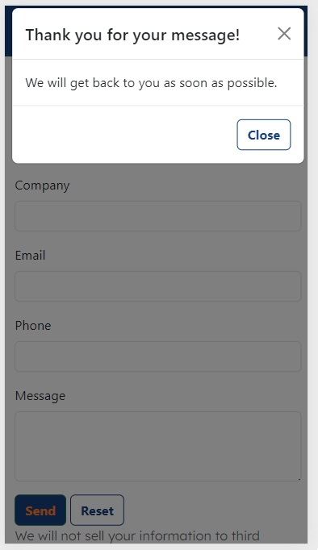
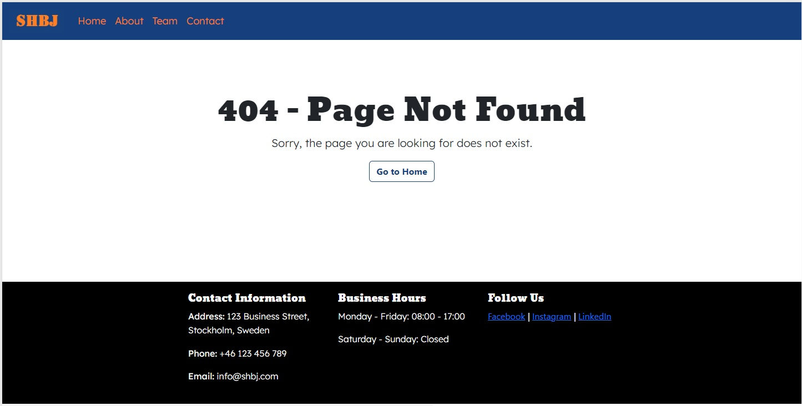
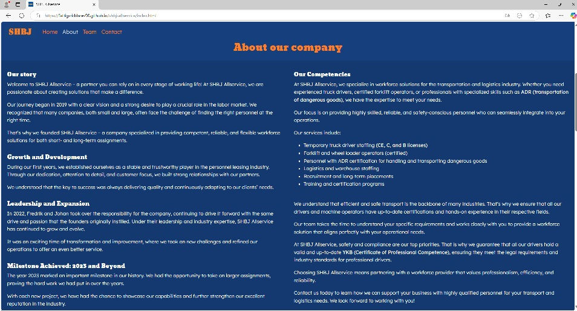
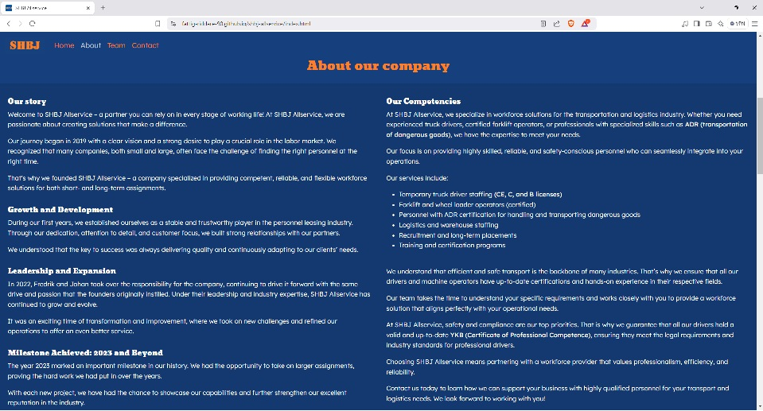
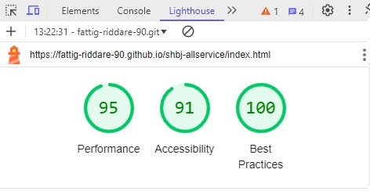
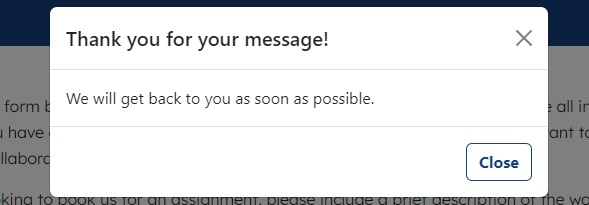

# Testing

> [!NOTE]
> Return back to the [README.md](README.md) file.

## Code Validation

### HTML

I have used the recommended [HTML W3C Validator](https://validator.w3.org) to validate all of my HTML files.

| Directory | File | URL | Screenshot | Notes |
| --- | --- | --- | --- | --- |
|  | [404.html](https://github.com/fattig-riddare-90/shbj-allservice/blob/main/404.html) | [HTML Validator](https://validator.w3.org/nu/?doc=https://fattig-riddare-90.github.io/shbj-allservice/404.html) |  | Notes (if applicable) |
|  | [index.html](https://github.com/fattig-riddare-90/shbj-allservice/blob/main/index.html) | [HTML Validator](https://validator.w3.org/nu/?doc=https://fattig-riddare-90.github.io/shbj-allservice/index.html) |  | Notes (if applicable) |

### CSS

I have used the recommended [CSS Jigsaw Validator](https://jigsaw.w3.org/css-validator) to validate all of my CSS files.

| Directory | File | URL | Screenshot | Notes |
| --- | --- | --- | --- | --- |
| assets | [style.css](https://github.com/fattig-riddare-90/shbj-allservice/blob/main/assets/css/style.css) | [CSS Validator](https://jigsaw.w3.org/css-validator/validator?uri=https://fattig-riddare-90.github.io/shbj-allservice) |  | For some reason the jigsaw page is in Swedish for me, however it says I had no errors |

## Responsiveness

I've tested my deployed project to check for responsiveness issues.

| Page | Mobile | Tablet | Desktop | Notes |
| --- | --- | --- | --- | --- |
| Header |  |  |  | Works as expected |
| Nav |  |  |  | Works as expected |
| About |  |  |  | Works as expected |
| Team |  |  |  | Works as expected |
| Cards |  |  |  | Works as expected |
| Contact |  |  |  | Works as expected |
| Form |  |  |  | Works as expected |
| Footer |  |  |  | Works as expected |
| Modal |  |  |  | Works as expected |
| 404 |  |  |  | Works as expected |

## Browser Compatibility

I've tested my deployed project on multiple browsers to check for compatibility issues.

| Page | Edge | Firefox | Brave | Notes |
| --- | --- | --- | --- | --- |
| Header |  |  |  | Works as expected |
| About |  |  |  | Works as expected |
| Team |  |  |  | Works as expected |
| Contact |  |  |  | Works as expected |
| Footer |  |  |  | Works as expected |
| 404 |  |  |  | Works as expected |

## Lighthouse Audit

I've tested my deployed project using the Lighthouse Audit tool to check for any major issues. Some warnings are outside of my control, and mobile results tend to be lower than desktop.

| Page | Mobile | Desktop |
| --- | --- | --- |
| Index |  |  |
| 404 |  |  |

## Defensive Programming

Defensive programming was manually tested with the below user acceptance testing:

| Page | Expectation | Test | Result | Screenshot |
| --- | --- |  --- |  --- |  --- |
| Header | Show the user an appealing image and the company name and slogan | I entered the home page. |  And was shown an appealing image with the company name and slogan in the header, Success. |  |
| Navbar | Take the user to the section indicated by the link in the navbar | Click all of the links in the navbar | I was taken to each page in turn after clicking on their respective link in the navbar |  |
| Form | The user should not be able to submit the form without filling it out correctly | Testing each field in turn by trying to submit the form with the field unfilled or with the wrong kind of character (numerical or alphabetical ) | As expected I was told to fill out the respective fields correctly before being able to submit the form |  |
| Modal | To give the user assurance that their form was submitted successfully | Filled out the form and submitted it. | The modal showed up as it should |  |
| Social links | To take the user to the respective social media indicated in the links name on a new tab | Clicked the respective links | Was taken to a new tab with the social media site on, as the links don't lead to any specific account on the social media |  |
| 404 | To show up if the user tries to enter a page on the site that does not exist | I tried entering /test after the site url | Ended up on the 404-page as I should |  |

## User Story Testing

| Target | Expectation | Outcome | Screenshot | 
| --- | --- | --- | --- | 
| As a business owner | I want to quickly see if SHBJ Allservice provides the personnel I need, so I can decide if I should reach out to them for more information.| Competencies are easily found in the "about-section" |  |
| As a project manager | I want to access the contact details easily so I can get in touch with SHBJ Allservice for specific inquiries about available staff. | Click on navbar to be taken to the "contact-section" |  |
| As a user | I want to easily navigate the website and find relevant information without unnecessary steps, so I can save time and make decisions faster. | The navbar is ever-present in the top of the screen |  |
| As a first time visitor | I want the company to make a good impression and the site to clearly show what sector of business they focus on. | The header makes a good impression with its style and conveys that this company is in the transport sector |  |

## Bugs

### Fixed Bugs

I've used [GitHub Issues](https://www.github.com/fattig-riddare-90/shbj-allservice/issues) to track and manage bugs and issues during the development stages of my project.

All previously closed/fixed bugs can be tracked [here](https://www.github.com/fattig-riddare-90/shbj-allservice/issues?q=is%3Aissue+is%3Aclosed+label%3Abug).

### Unfixed Bugs

Any remaining open issues can be tracked [here](https://www.github.com/fattig-riddare-90/shbj-allservice/issues).

### Known Issues

> [!IMPORTANT]
> There are no remaining bugs that I am aware of, though, even after thorough testing, I cannot rule out the possibility.

